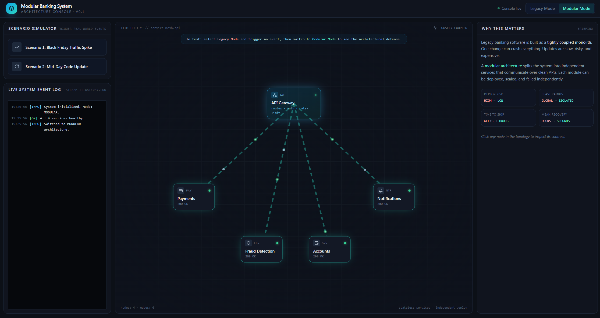

# Banking Ledger Modernization Prototype

[📖 Read the Full Article] https://medium.com/@aaryan17.badyal/from-game-loops-to-core-ledgers-re-engineering-banking-with-game-engine-architecture-1e583c1bbe40?sharedUserId=aaryan17.badyal

A high-performance prototype demonstrating an event-driven, node-based core banking architecture designed to replace legacy batch-processing infrastructure with real-time, fault-tolerant transaction processing.

---

## Overview

Over 60% of global banking infrastructure still relies on legacy COBOL mainframe systems and overnight batch processing. This architecture introduces severe bottlenecks in real-time transaction processing, scalability limits, and high operational overhead during core modernizations.

This prototype models a modernized **event-driven, node-based ledger architecture** that shifts away from monolithic batch runs toward deterministic, continuous transaction reconciliation.

### Key Capabilities
* **Event-Driven Processing:** Moves from legacy batch updates to real-time, event-based state execution.
* **Node-Based Modular Architecture:** Decouples core ledger execution into independent processing nodes for higher availability and linear horizontal scaling.
* **Determinism & Auditability:** Maintains strict transaction sequencing and an append-only event log for real-time compliance and audit trails.
* **Low-Latency Balance Settlement:** Reconciles multi-account transfers without holding global database locks.

---

## System Architecture

Instead of queuing transactions for overnight batch runs, incoming state updates are processed via a continuous event loop across distributed validation nodes:
